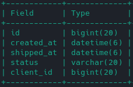
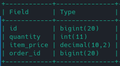
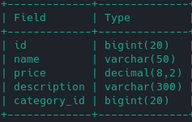

# Exercise 2 - Requirement 1

## Description

Either the tables without the relations:

- clients    : firstname, lastname
- products   : name, price, description
- categories : name, description
- orders     : created_at, shipped_at, status
- order_items: quanity, item_price

Create template classes derived from ActiveRecord for each of these entities with the associations:
- A product has only one category. A category groups several products.
- An order is ordered by a customer. A customer can place several orders.
- An order is composed of several order_items which each reference a product.

## Resolution

1. Create Migration files
```shell
rake db:new_migration name=CreateClient      options="firstname:string lastname:string"
rake db:new_migration name=createCategory    options="name:string description:string"
rake db:new_migration name=CreateProduct     options="name:string price:decimal description:string"
rake db:new_migration name=CreateOrder       options="status:string created_at:datetime  shipped_at:datetime"
rake db:new_migration name=create_order_item options="quantity:integer item_price:decimal"
```
2. Execute migration:
```shell
rake db:drop db:create db:migrate
```

3. Update migrations files
You have to define limit, cascade etc in theses files in `db/migrate/*`.

- Max for string: `t.string :firstname, limit: 60`
- Precisions for decimals `t.decimal :item_price, precision: 10, scale: 2`

- To reference relations you have to add 
    - `t.references :category, foreign_key: true, type: :bigint` (in `create_product`)
    - `t.references :client, foreign_key: true, type: :bigint`(in `create_order`)
    - `t.references :order, foreign_key: { on_delete: :cascade }`(in `create_order_item`)

4. Create models
```shell
touch models/client.rb models/category.rb models/product.rb models/order.rb models/order_item.rb 
```

5. Translate relations in models

An `order` is ordered by a customer
```ruby
class Order < ActiveRecord::Base
  belongs_to :client
end
```

A `customer` can place several orders.
```ruby
class Client < ActiveRecord::Base
    has_many :orders
end
```

Add in `order` is composed of `several` order_items which each reference a product.

```ruby
class Order < ActiveRecord::Base
    has_many :order_items
    has_many :products, through: :order_items
end

class Product < ActiveRecord::Base
    has_many :orders, through: :order_items
    has_many :order_items
    belongs_to :category
end

class OrderItem < ActiveRecord::Base
    belongs_to :order
    belongs_to :product, foreign_key: 'item_id'
end
```

`Table orders`



`Table order_items`



`Table products`

