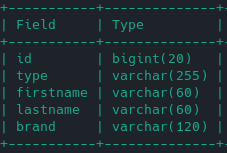

# Exercise 2 - Requirement 6

## Description
clients have two different types:
- individuals
- companies
Adapt your code to take into account this change

## Resolution

1. Add `type` and `brand` to client
```shell
rake db:new_migration name=add_type_to_clients
rake db:new_migration name=inherit_company_from_client
```

2. Add in your migration file:
```ruby
class AddTypeToClient < ActiveRecord::Migration[7.0]
  def change
    add_column :clients, :type, :string, :after => :id
  end
end
```

```ruby
class InheritCompanyFromClient < ActiveRecord::Migration[7.0]
  def change
    change_table :clients do |t|
        t.string :brand, limit: 120
    end
  end
end
```

3. Apply changes
```shell
rake db:drop db:create db:migrate
```

Your table `clients` should look like this:




4. Create models for company and individuals
```shell
touch models/company.rb
touch models/individual.rb
```

5. Extend client

`company.rb`
```ruby
class Company < Client
end
```

`individual.rb`
```ruby
class Individual < Client
  validates :firstname, :lastname, presence: true, length: { minimum: 3 }
end
```

6. Override `to_s` to test the result in `client.rb`
```
def to_s
    "#{firstname} #{lastname} (#{type})"
end
```

7. Override `to_s` to test the result in `company.rb`
```
def to_s
  "#{brand} (#{type})"
end
```